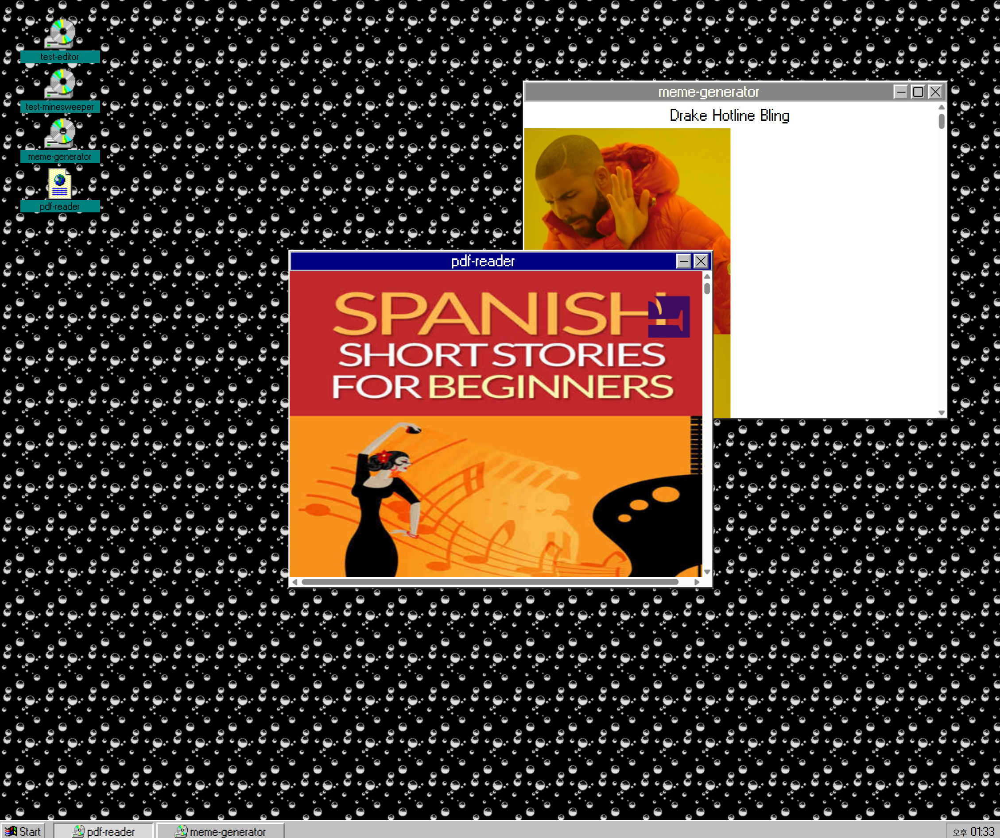

# PWA-Windows - WIndows 95 themed PWA app based on reactjs



### Deployed / Download link : [Github page](https://jihyeonjeong11.github.io/pwa-github-page/)

Current stage: Proof of Concepts - building first program PDF Reader

## 설치법

```
git clone
yarn
yarn dev
```

## Features

### PWA

- PWA powered by [Vite PWA](https://vite-pwa-org.netlify.app/)

- Windows & Process management inspired by [DaedalOS](https://dustinbrett.com/)

- Windows 95 theme by [Windows 95 UI Kit](https://themesberg.com/product/ui-kit/windows-95-ui-kit)

- PDF reader and controls by [PDFjs](https://www.npmjs.com/package/pdfjs-dist)

- PDF print by [Printjs](https://printjs.crabbly.com/)

### Feature lists - Todo

#### - Desktop & Wallpaper

#### - Some Real app(use Webaseembly or, text editor)

### Feature lists - WIP

#### - Contexts

#### - Taskbar

#### - Styling

#### - Windows(Rnd) feature

#### - Windows animation(motion)

### Featire lists - Done

#### - Taskbar clock

## License

교육적인 목적으로 제작되었습니다. 상업적인 목적으로 사용할 수 없고 마이크로소프트로부터 공식 인증을 받지 않았습니다.
